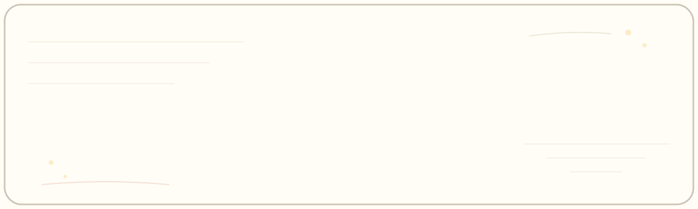
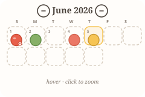
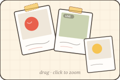
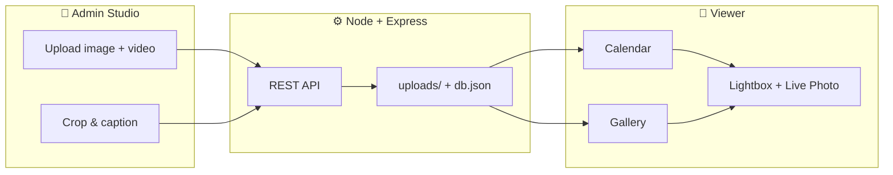

<div align="center">

# 🍎 An Apple A Day

**Store apple-themed Live Photos of the day — cute, hand-drawn, and a little bit magic.**



<!-- Static fallback: public/assets/readme-hero.svg -->

<br />

[](https://nodejs.org/)
[](https://expressjs.com/)
[](#)
[](#-live-photos)
[](#-embedding)

*A little live photo, every day — apple-shaped calendar or draggable polaroid booth.*

[Quick Start](#-quick-start) · [Features](#-features) · [Admin & Auth](#-admin--auth) · [API](#-api) · [Embed](#-embedding)

</div>

<!-- mode showcase: calendar + gallery visuals -->
<div align="center">

<table>
<tr>
<td align="center" width="50%" style="padding:14px 12px; vertical-align:top; background:#fffdfa; border:2px dashed #d9cfc1; border-radius:16px;">
<br />
<strong>📅 Calendar</strong><br />
<sub>apple clips · hover · zoom</sub>
</td>
<td width="12"></td>
<td align="center" width="50%" style="padding:14px 12px; vertical-align:top; background:#fdf4e3; border:2.5px solid #4a423b; border-radius:12px; box-shadow:3px 5px 0 #4a423b;">
<br />
<strong>🖼️ Gallery</strong><br />
<sub>polaroids · drag · handwriting</sub>
</td>
</tr>
</table>

</div>

---

## ✨ About

**An Apple A Day** (*AppleDairy*) is a self-hosted mini gallery for your daily apple moments. Upload a still image plus an optional Live Photo clip each day, add a handwritten-style caption, and share them in two delightful views:

<table>
<tr>
<td width="50%" valign="top" style="padding:12px; background:#fffdfa; border-left:4px solid #e8604c; border-radius:0 12px 12px 0;">

**📅 Calendar mode**

Monthly grid with **apple-shaped thumbnails** centered on each date. Gentle sway, hover highlight, click-to-zoom lightbox with caption + date. Admin crop picks exactly what shows inside each apple.

</td>
<td width="50%" valign="top" style="padding:12px; background:#fdf4e3; border-left:4px solid #f6c453; border-radius:0 12px 12px 0;">

**🖼️ Gallery mode**

Corkboard of **draggable polaroids** with handwriting captions. Frames match each photo's aspect ratio. Random scatter, tape on top, tap to zoom — like a cute photo booth wall.

</td>
</tr>
</table>

Both modes support **Live Photo playback** on hover and in the lightbox. The viewer embeds cleanly into any website.

---

## 🌿 Features

<table>
<tr>
<td width="50%" valign="top" style="padding:14px; background:#fffdfa; border:2px dashed #d9cfc1; border-radius:14px;">

### 📅 Calendar mode

- Apple-shaped photo clips on each day
- Gentle sway animation & hover highlight
- Click-to-zoom lightbox with date + caption
- Crop editor picks the calendar thumbnail area

</td>
<td width="50%" valign="top" style="padding:14px; background:#fdf4e3; border:2px solid #4a423b; border-radius:10px; box-shadow:2px 4px 0 #4a423b;">

### 🖼️ Gallery mode

- Randomly scattered, **draggable** polaroids
- Handwriting captions (description + date)
- Frames adapt to each photo's aspect ratio
- Tap/click polaroid to zoom in

</td>
</tr>
<tr><td colspan="2" height="8"></td></tr>
<tr>
<td width="50%" valign="top" style="padding:14px; background:#fffdfa; border:2px solid #87b067; border-radius:14px;">

### 📱 Admin Studio

- Upload & edit from **phone or desktop**
- Still image + optional Live Photo video
- Per-day descriptions and calendar crop
- Password-protected when deployed

</td>
<td width="50%" valign="top" style="padding:14px; background:#fffdfa; border:2px dashed #f6c453; border-radius:14px;">

### 🧩 Embed anywhere

- One-script widget (`embed.js`) or iframe
- Calendar or gallery as default mode
- Public read API for the viewer

</td>
</tr>
</table>

---

## 🎨 Design

Hand-drawn sketch aesthetic — warm paper tones, wobbly borders, **Caveat** handwriting and **Quicksand** UI. No build step: vanilla HTML, CSS, and JavaScript on a tiny Node backend.

<div align="center">

<table>
<tr>
<td align="center" style="padding:8px 14px;"><span style="display:inline-block;width:28px;height:28px;background:#e8604c;border:2px solid #4a423b;border-radius:50%;"></span><br/><sub>apple</sub></td>
<td align="center" style="padding:8px 14px;"><span style="display:inline-block;width:28px;height:28px;background:#87b067;border:2px solid #4a423b;border-radius:50%;"></span><br/><sub>leaf</sub></td>
<td align="center" style="padding:8px 14px;"><span style="display:inline-block;width:28px;height:28px;background:#fffdf6;border:2px dashed #d9cfc1;border-radius:50%;"></span><br/><sub>paper</sub></td>
<td align="center" style="padding:8px 14px;"><span style="display:inline-block;width:28px;height:28px;background:#f6c453;border:2px solid #4a423b;border-radius:50%;"></span><br/><sub>accent</sub></td>
<td align="center" style="padding:8px 14px;"><span style="display:inline-block;width:28px;height:28px;background:#fdf4e3;border:2px solid #4a423b;border-radius:50%;"></span><br/><sub>booth</sub></td>
</tr>
</table>

`#e8604c` · `#87b067` · `#fffdf6` · `#f6c453` · **Caveat** + **Quicksand**

</div>

---

## 🚀 Quick start

```bash
git clone https://github.com/SummerPapaya/AppleDairy.git
cd AppleDairy
npm install
cp .env.example .env   # set ADMIN_PASSWORD for production
npm run seed           # optional: demo apples for June 2026
npm start
```

| URL | Purpose |
| --- | --- |
| http://localhost:3000 | Viewer — 📅 calendar / 🖼️ gallery |
| http://localhost:3000/admin | 🍎 Upload & edit studio |
| http://localhost:3000/embed | 🧩 Embedding guide + live preview |
| http://localhost:3000/readme-preview | 📄 README preview (local) |

> **ffmpeg** (optional) transcodes iPhone `.mov` Live Photo clips to web-friendly MP4. Without it, original video files are kept as-is.

---

## 🔐 Admin & auth

Set credentials via environment or `.env`:

```bash
ADMIN_USER=admin
ADMIN_PASSWORD=your-strong-password
npm start
```

| When `ADMIN_PASSWORD` is set | Behavior |
| --- | --- |
| ✅ | `/admin` requires sign-in; write APIs are protected |
| ✅ | `GET /api/photos` stays **public** for the gallery |
| ⚠️ Unset | Auth disabled — local dev only; server logs a warning |

Never commit `.env` — it is gitignored.

---

## 🏗️ How it works



| Layer | Stack |
| --- | --- |
| Server | Node.js, Express, Multer |
| Storage | `uploads/` (media) + `data/db.json` (metadata) |
| Frontend | Vanilla HTML / CSS / JS — zero build step |
| Live Photos | Still + short looping video (hover & zoom) |

---

## 📡 API

<details>
<summary><strong>Photos</strong></summary>

| Method | Route | Auth | Description |
| --- | --- | :---: | --- |
| `GET` | `/api/photos` | — | List all photos (newest date first) |
| `GET` | `/api/photos/:id` | — | Get one photo |
| `POST` | `/api/photos` | 🔒 | Create — `multipart`: `date`, `description`, `image`, `video?` |
| `PUT` | `/api/photos/:id` | 🔒 | Update fields / replace media / `removeVideo` |
| `DELETE` | `/api/photos/:id` | 🔒 | Delete photo and files |

</details>

<details>
<summary><strong>Auth</strong></summary>

| Method | Route | Description |
| --- | --- | --- |
| `GET` | `/api/auth/status` | Whether auth is required & session valid |
| `POST` | `/api/auth/login` | Sign in — `{ "username", "password" }` |
| `POST` | `/api/auth/logout` | Sign out (clears session cookie) |

</details>

---

## 🧩 Embedding

Drop the widget into any page:

```html
<div id="apple-a-day"></div>
<script src="https://YOUR-HOST/embed.js"
        data-target="#apple-a-day"
        data-mode="calendar"
        data-height="640"></script>
```

Or use a plain iframe:

```html
<iframe src="https://YOUR-HOST/?mode=gallery"
        style="width:100%;height:640px;border:0;border-radius:18px"
        title="An Apple A Day"></iframe>
```

See `/embed` on your running instance for a live preview.

---

## 📁 Project layout

```
AppleDairy/
├── server.js           # Express API + static hosting
├── public/
│   ├── index.html      # Viewer
│   ├── admin.html      # Studio
│   ├── embed.js        # Embeddable widget loader
│   └── js/             # Viewer & admin logic
├── uploads/            # Photo & video files (gitignored)
├── data/db.json        # Metadata (gitignored)
└── scripts/seed.js     # Optional demo data
```

---

<div align="center">

**An apple a day keeps the ordinary away.** 🍎

Made with care · MIT License

</div>
